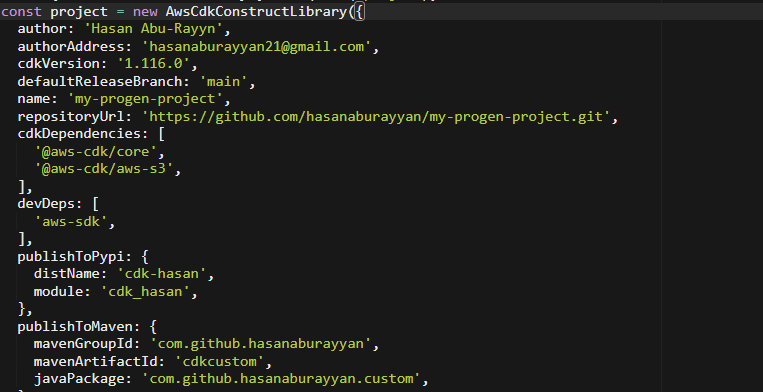
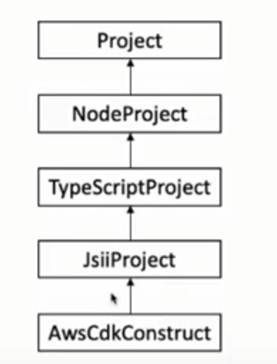
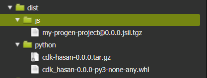

# Building Reusable Code
## JSii
allows code in any language to naturally interact with JavaScript classes. It is the technology that enables the AWS Cloud Development Kit to deliver polyglot libraries from a single
codebase!

A class library written in TypeScript can be used in projects authored in TypeScript or Javascript (as usual), but also in Python, Java, C# (and other languages from the .NET family), ...

[For More On JSii](https://github.com/aws/jsii)

## Projen
Define and maintain complex project configuration through code.

projen synthesizes project configuration files such as package.json, tsconfig.json, .gitignore, GitHub Workflows, eslint, jest, etc from a well-typed definition written in JavaScript.

As opposed to existing templating/scaffolding tools, projen is not a one-off generator. Synthesized files should never be manually edited (in fact, projen enforces that). To modify your project setup, 
users interact with rich strongly-typed class and execute projen to update their project configuration files.

A CDK for project creation. Gives us well defined APIs and Object Oriented Principles when creating and maintaining new projects.

**Can Keep Project JSii Compliant!!**

[For More On Projen](https://github.com/projen/projen)

#### Projen RC File Examples

[Back To Agenda](../README.md)

[Next Topic]()
